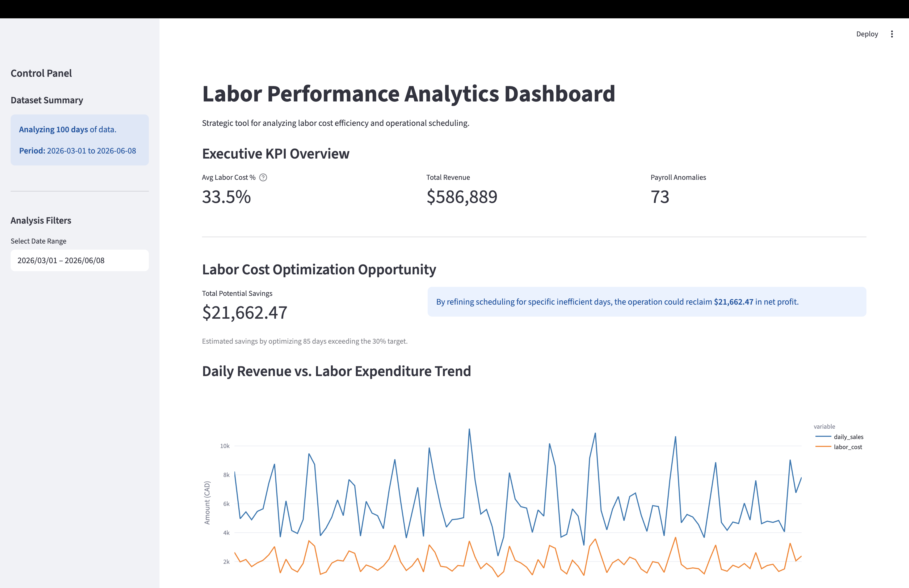
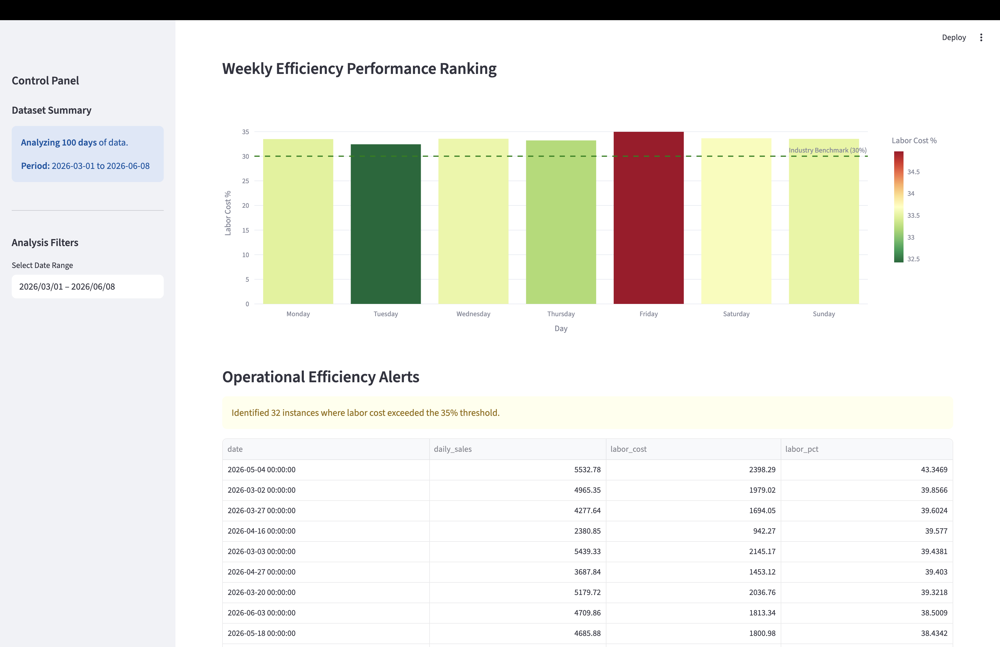

# Labor Performance Insights Dashboard

A decision-making tool designed for restaurant managers to optimize labor costs and monitor scheduling efficiency. Provides actionable insights into labor-to-sales ratios and payroll error patterns.

## Dashboard Preview

<table>
  <tr>
    <td></td>
    <td></td>
  </tr>
</table>

> *Interactive visualization of weekly labor trends and cost-saving opportunities.*

## Key Insights Provided

- **Labor Efficiency**: Visualize the correlation between hourly sales and labor costs.
- **Cost Savings**: Automated calculation of potential savings by optimizing off-peak scheduling.
- **Data Integrity**: Detecting anomalies in manual time-clock overrides.

## Technical Stack

- **Language**: Python 3.10
- **Package Manager**: [uv](https://docs.astral.sh/uv/)
- **Framework**: Streamlit (Interactive Web App)
- **Data Libraries**: Pandas (Transformation), Plotly (Advanced Visualization)

## Directory Structure
```
├── data/                  # Mock datasets for analysis
├── preview/               # Dashboard preview screenshots
├── research/              # EDA experiments
├── data_generator.py      # Generates mock restaurant operations data
├── main.py                # Entry point
├── app.py                 # Streamlit dashboard application
├── pyproject.toml         # Project metadata and dependency definitions
├── requirements.txt       # For deployment (e.g. Streamlit Cloud)
└── uv.lock                # Lockfile for reproducible environments
```

## Prerequisites

Install [uv](https://docs.astral.sh/uv/) if you haven't already:

```bash
# macOS / Linux
curl -LsSf https://astral.sh/uv/install.sh | sh

# Windows
powershell -ExecutionPolicy ByPass -c "irm https://astral.sh/uv/install.ps1 | iex"
```

## How to Run

```bash
# 1. Install dependencies
uv sync

# 2. Generate mock data
uv run python data_generator.py

# 3. Run dashboard
uv run streamlit run app.py
```

## Note on Data Privacy

All datasets used in this project are programmatically generated **mock data** that reflect real-world restaurant operations, including weekend peak trends and role-based wage variances.
